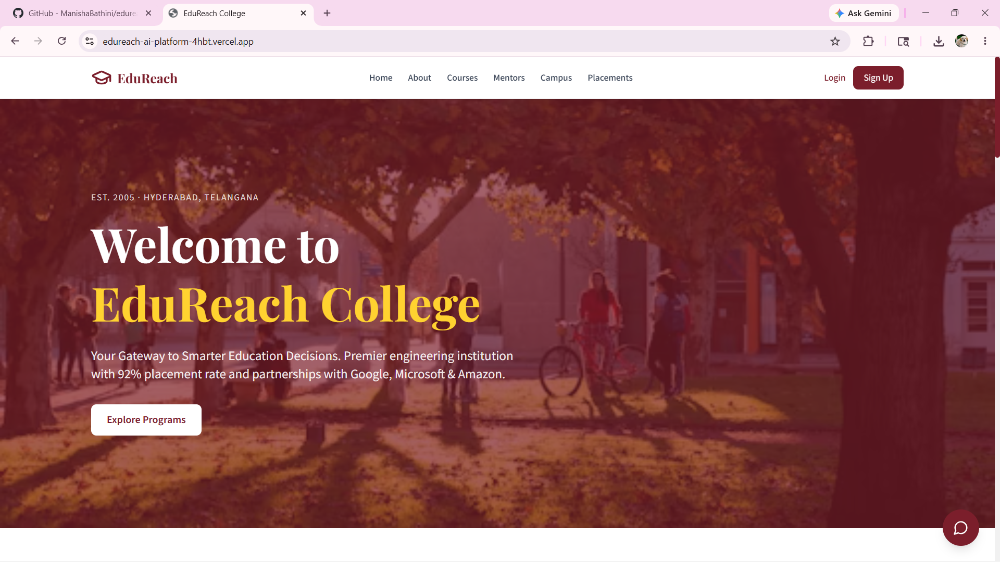
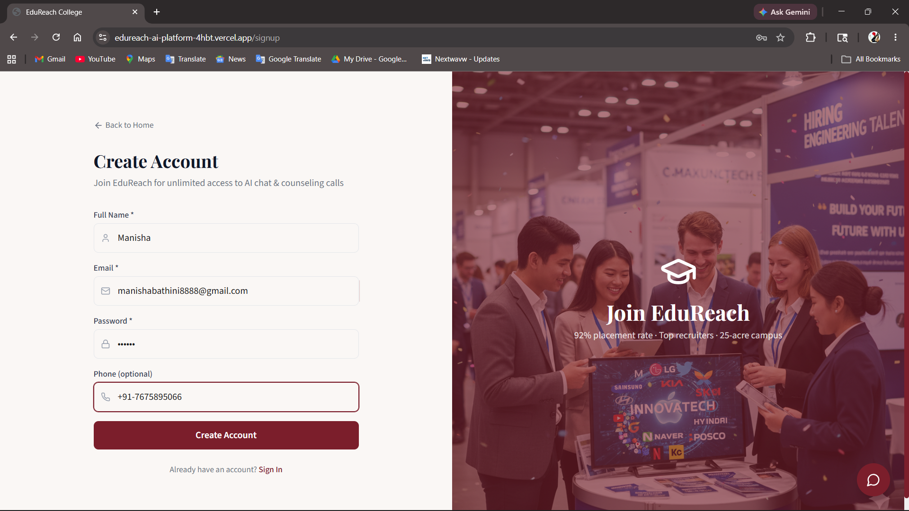
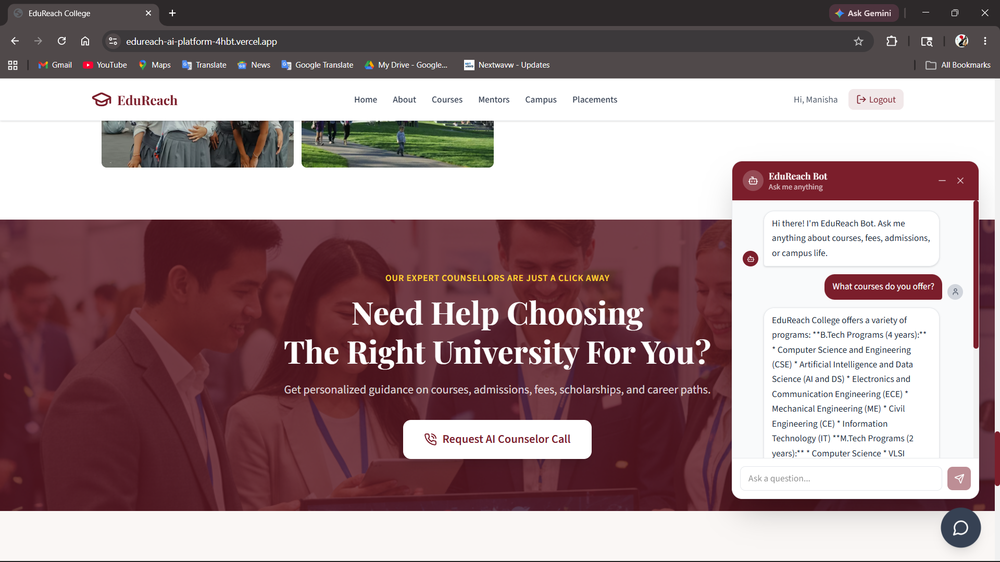
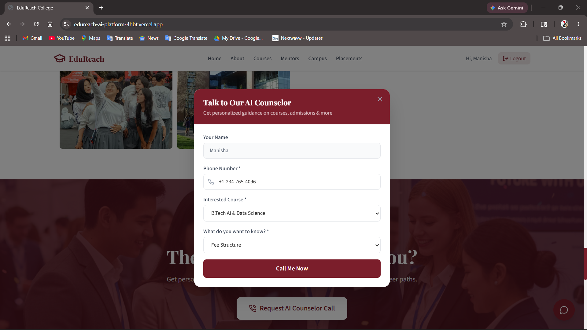
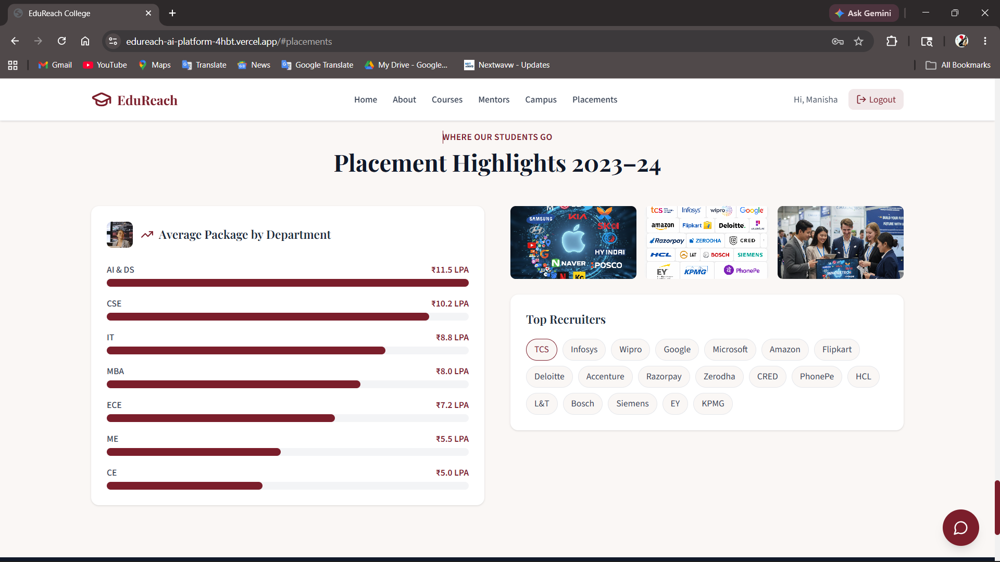

# EduReach AI Platform

AI-powered college guidance platform built using React, Node.js, MongoDB Atlas Vector Search, Gemini API, and Retrieval-Augmented Generation (RAG) to provide contextual and intelligent student assistance.

---

## 🌐 Live Demo

Frontend: https://edureach-ai-platform-4hbt.vercel.app/

Backend API: https://edureach-backend-34aq.onrender.com

---

## 🚀 Overview

EduReach is an AI-powered college guidance platform that helps students get contextual information about admissions, courses, placements, scholarships, and campus details through an intelligent RAG-based chatbot.

The platform combines semantic search, vector embeddings, and generative AI to provide accurate and context-aware responses instead of simple keyword matching.

---

## ✨ Features

### 🤖 AI RAG Chatbot
- Context-aware AI assistant
- Retrieval-Augmented Generation (RAG)
- Semantic search with vector embeddings
- Intelligent responses using Gemini API
- Handles admission, placements, fees, scholarships, and course-related queries

### 🔍 MongoDB Atlas Vector Search
- Stores embeddings for semantic search
- Retrieves relevant knowledge chunks intelligently
- Improves AI response quality and context understanding

### 🔐 JWT Authentication
- Secure user signup/login system
- Protected routes and authenticated access

### 📞 AI Callback Request System
- Students can request counseling support
- AI-assisted counselor interaction workflow

### 🎨 Modern Responsive UI
- Fully responsive design
- Interactive chatbot interface
- Smooth user experience across devices

---

## 🛠️ Tech Stack

### Frontend
- React.js
- TypeScript
- Tailwind CSS
- Axios
- React Router DOM
- Vite

### Backend
- Node.js
- Express.js
- TypeScript

### Database
- MongoDB Atlas
- MongoDB Atlas Vector Search

### AI & RAG
- Gemini API
- LangChain
- Embeddings
- Recursive Character Text Splitter

### Authentication
- JWT (JSON Web Tokens)
- Cookies

---

## 🧠 How RAG Works In This Project

1. College-related data is converted into embeddings
2. Embeddings are stored in MongoDB Atlas Vector Search
3. User queries are converted into embeddings
4. Relevant knowledge chunks are retrieved semantically
5. Gemini API generates contextual responses using retrieved data

This enables intelligent and context-aware AI conversations.

---

## 📂 Project Structure

```bash
edureach-platform/
│
├── client/         # React Frontend
├── server/         # Node.js Backend
├── screenshots/    # Project Screenshots
├── README.md
└── .gitignore
```

---

## ⚙️ Installation & Setup

### 1️⃣ Clone Repository

```bash
git clone https://github.com/ManishaBathini/edureach-ai-platform.git
```

### 2️⃣ Install Frontend Dependencies

```bash
cd client
npm install
```

### 3️⃣ Install Backend Dependencies

```bash
cd ../server
npm install
```

### 4️⃣ Setup Environment Variables

Create a `.env` file inside the `server/` directory:

```env
MONGODB_URI=your_mongodb_uri

JWT_SECRET=your_jwt_secret

GOOGLE_API_KEY=your_google_api_key

VAPI_API_KEY=your_vapi_api_key
VAPI_ASSISTANT_ID=your_assistant_id
VAPI_PHONE_NUMBER_ID=your_phone_number_id

CLIENT_URL=http://localhost:5173
```

---

## ▶️ Run Project

### Start Backend

```bash
cd server
npm run dev
```

### Start Frontend

```bash
cd client
npm run dev
```

---

## 📸 Screenshots

### 🏠 Homepage


### 🤖 SignUp Page


### 🤖 AI Chatbot


### 📞 Callback Request Form


### 🎯 Placement Highlights


---

## 🔥 Challenges Faced

- Implementing Retrieval-Augmented Generation (RAG)
- Managing vector embeddings and semantic search
- Handling frontend-backend integration
- Authentication and protected route handling
- Improving AI response accuracy and context retrieval
- Debugging API integration and deployment workflows

---

## 📈 Future Improvements

- Voice-enabled AI counselor
- Multi-language support
- Real-time admission tracking
- AI-powered career recommendations
- Admin dashboard for colleges
- Advanced analytics and insights
